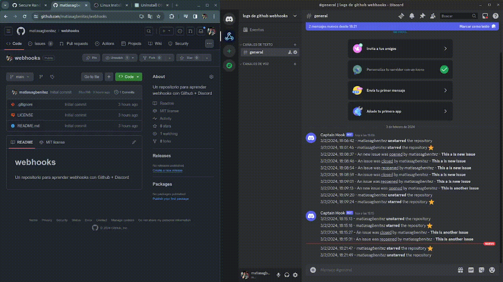
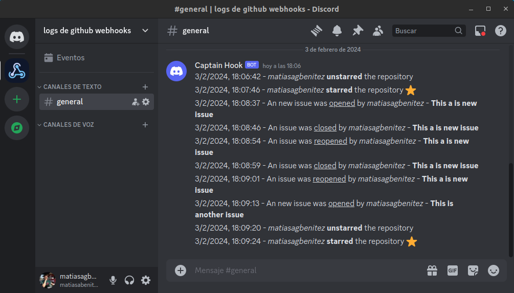

# github-webhooks

Dive into the world of webhooks and enhance your understanding of GitHub basics with this hands-on learning repository! 🌐 Developed using Node.js with Express.js, this project focuses on creating a server that efficiently listens to and handles "star" and "issues" events in a GitHub repository. The server captures relevant information and seamlessly relays it to a Discord server, providing detailed insights into the nature of the events.

## Installation

Clone the repository and install the dependencies.

```bash
git clone https://github.com/matiasagbenitez/github-webhooks
cd github-webhooks
npm install
```

Create a `.env` file in the root directory and add the following environment variables.

```bash
PORT=3000
DISCORD_WEBHOOK_URL=https://discord.com/api/webhooks/your-webhook-url
SECRET_TOKEN=your-secret-token
```

## Add a Webhook to Your GitHub Repository

1. Navigate to the repository where you want to add the webhook.
2. Go to `Settings` > `Webhooks` > `Add webhook`.
3. In the `Payload URL` field, enter the URL of your server (e.g., `http://your-server-ip:3000/events`).

## Add a Webhook to Your Discord Server

1. Navigate to the channel where you want to add the webhook.
2. Click on `Edit channel` > `Integrations` > `Create Webhook`.
3. Customize the webhook and click on `Copy Webhook URL`.

## Usage

Start the server.

```bash
npm run dev
```

## Demo




